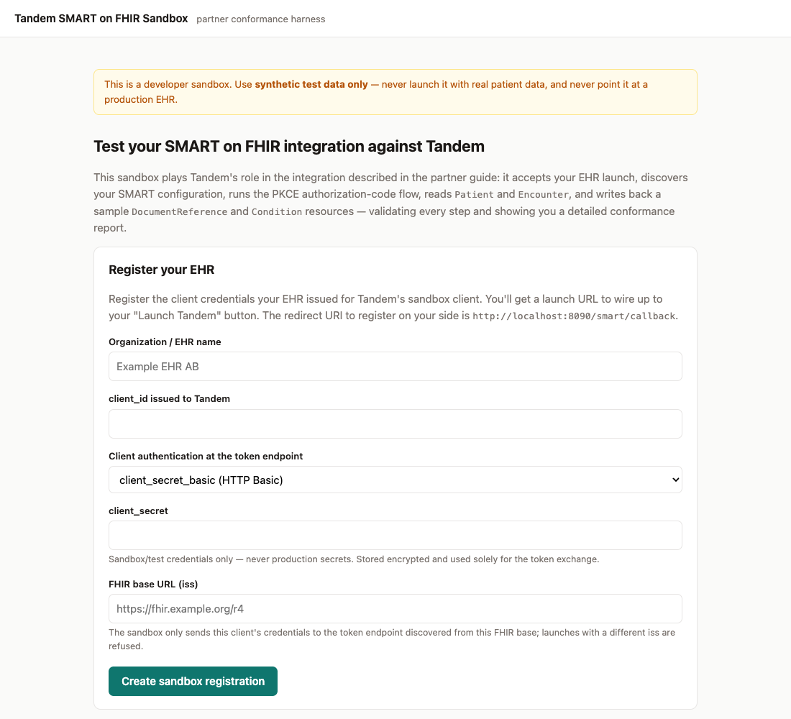
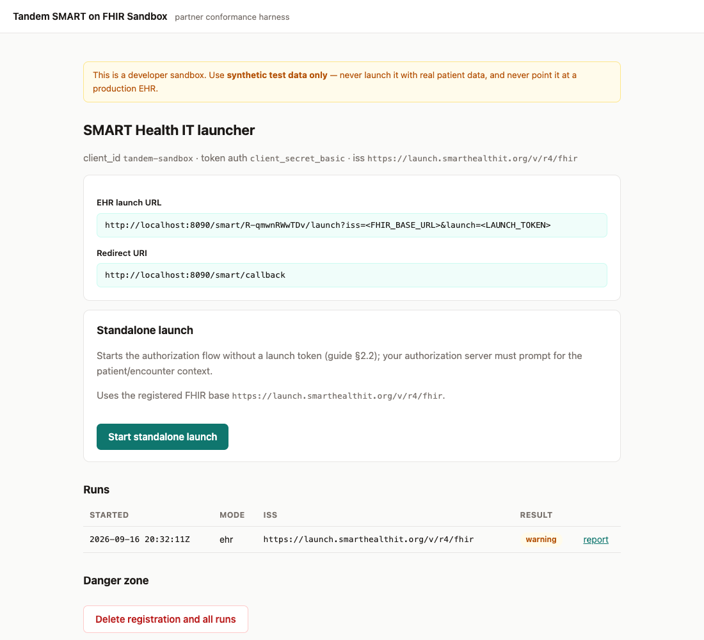
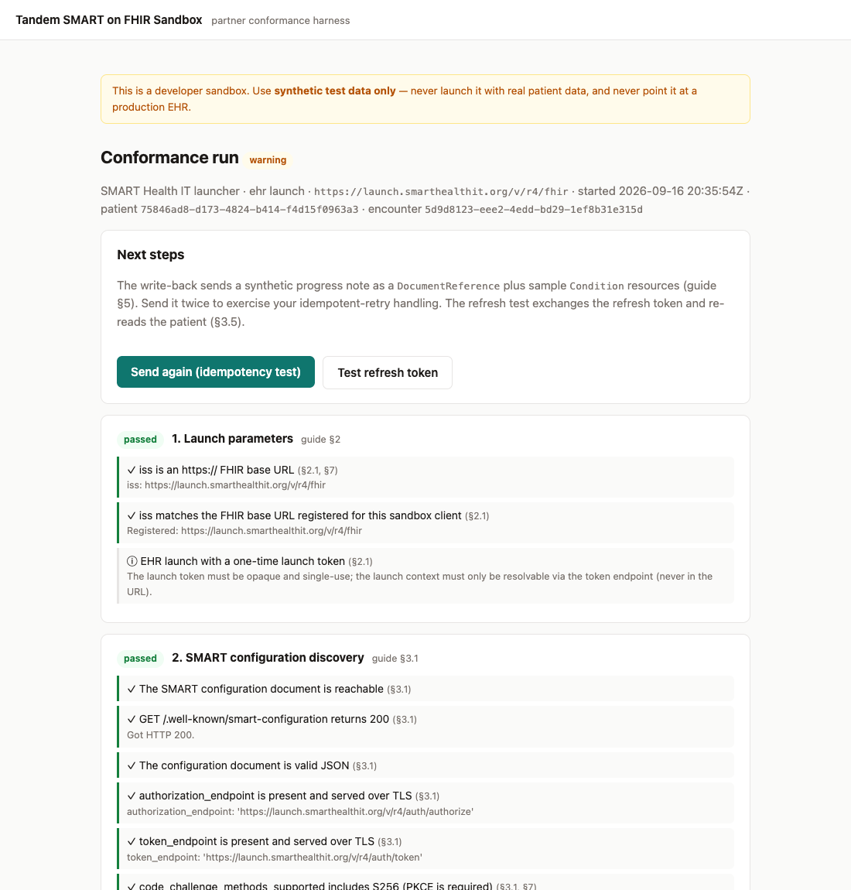

# SMART on FHIR Partner Sandbox

A self-service conformance harness that plays **Tandem's role** in the SMART on
FHIR integration described in the partner integration guide. You run it on
your own machine: register your test client, point your dev EHR's launch button
at the sandbox, and get a per-run conformance report — pass/warn/fail checks
that cite the guide section they verify, plus redacted HTTP transcripts of
every exchange.

**Never connect the sandbox to a system holding real patient data.** It writes
synthetic notes and conditions to whatever FHIR server it is pointed at.

What a run covers:

- **Discovery** (§3.1): `/.well-known/smart-configuration` shape, TLS-served
  endpoints, S256 PKCE support, capabilities and advertised scopes.
- **Authorization + token exchange** (§3.2–§3.4): authorization code flow with
  PKCE, `client_secret_basic`/`client_secret_post`, launch context (`patient`,
  `encounter`, `fhirUser`), refresh token issuance.
- **FHIR reads** (§4): `Patient` and `Encounter` field-level checks (name,
  subject linkage to the launch patient, participant, period, status).
- **Write-back** (§5, §6): a synthetic `DocumentReference` + two `Condition`
  resources, 201/`Location` validation, an idempotent-retry probe, and the
  401 → refresh → retry path.
- **Refresh** (§3.5): a standalone refresh-token exchange test.

## What it looks like

Register the client your EHR issued for the sandbox, together with your FHIR
base URL:



Your dashboard shows the launch URL to wire into the EHR, the redirect URI to
register on your side, and every run so far:



Each launch produces a report — every step graded against the integration
guide, with the redacted HTTP transcripts underneath. This run is against the
public [SMART Health IT launcher](https://launch.smarthealthit.org); the
warning is its test encounter being `finished` rather than in progress:



## Quick start

Pick whichever fits your machine; all three end up serving
<http://localhost:8090>.

**Python 3.11 or newer already installed** — plain `pip`, nothing else needed:

```bash
python3 -m venv .venv && source .venv/bin/activate   # Windows: .venv\Scripts\activate
pip install .
cp .env.example .env      # enables http:// and loopback/LAN EHR endpoints
smart-sandbox
```

**No Python** — [uv](https://docs.astral.sh/uv/) is a single binary that
fetches an interpreter for you:

```bash
cp .env.example .env
uv run smart-sandbox
```

Open <http://localhost:8090>, register the `client_id`/`client_secret` your EHR
issued for the sandbox client together with your FHIR base URL (`iss`), and
copy the launch URL the page shows you. The sandbox listens on `127.0.0.1`
only; keep it that way (no `--host 0.0.0.0`) while
`SANDBOX_ALLOW_PRIVATE_NETWORK` is on, since registration is open to anyone who
can reach the port. `smart-sandbox --help` lists the flags.

**Docker** — no Python at all:

```bash
docker build -t smart-sandbox .
docker run --rm -p 127.0.0.1:8090:8090 -v smart-sandbox-data:/data \
  -e SANDBOX_ALLOW_PRIVATE_NETWORK=true smart-sandbox
```

Inside Docker an EHR running on the host is reachable as
`host.docker.internal`.

## Wiring up your EHR

1. **Register the sandbox as a SMART app** in your dev EHR with redirect URI
   `http://localhost:8090/smart/callback` (or the equivalent under your
   `SANDBOX_PUBLIC_BASE_URL`). The scopes and launch context the sandbox
   requests are listed in the guide.
2. **Point your "Launch Tandem" button** at the launch URL shown after
   registration: `http://localhost:8090/smart/<slug>/launch`. Your EHR appends
   `iss` and `launch` as usual for an EHR launch. The `iss` must equal the
   FHIR base URL you registered — the sandbox only ever sends the client
   credentials to the token endpoint discovered from that base, and refuses
   launches from anywhere else. The dashboard also offers a standalone launch
   that skips the launch token.
3. **Launch from the EHR.** The sandbox runs discovery, redirects the browser
   to your authorization endpoint, handles the callback, reads
   `Patient`/`Encounter`, and shows the run report. From the report you can
   trigger the write-back and refresh tests.

If your authorization server refuses `http://localhost` redirect URIs, expose
the sandbox through a tunnel (ngrok, cloudflared, …) and set
`SANDBOX_PUBLIC_BASE_URL` to the tunnel's `https://` URL. A tunnel makes the
sandbox reachable from the Internet, and registration is open to anyone who can
reach it, so also set `SANDBOX_ALLOW_PRIVATE_NETWORK=false`: the sandbox
refuses to start otherwise, because remote callers could otherwise register a
"FHIR server" that points its requests at your machine or LAN. Your EHR then
needs to be reachable over public `https://` too. Prefer a tunnel that
requires authentication (both ngrok and cloudflared can add basic auth or an
access policy) so only you can register and launch.

## Trying it without an EHR

The public [SMART Health IT launcher](https://launch.smarthealthit.org)
simulates an EHR and lets you pick the credentials it expects, so you can see a
full report before wiring up your own system:

1. In the launcher, choose **Provider EHR Launch**, **R4**, and pick a patient
   and a practitioner. Under *Client Registration & Validation* select
   **Confidential Symmetric**, **Strict** identity validation and PKCE
   **Always**; enter a `client_id` and `client_secret` of your choosing, the
   redirect URI `http://localhost:8090/smart/callback`, and the scopes
   `launch openid fhirUser offline_access patient/Patient.read patient/Encounter.read patient/DocumentReference.write patient/Condition.write`.
2. Register those credentials in the sandbox with FHIR base URL
   `https://launch.smarthealthit.org/v/r4/fhir` (for an EHR launch the
   launcher passes the plain server URL as `iss`; the launch context travels in
   the `launch` token).
3. Paste the sandbox launch URL into the launcher's *App's Launch URL* and
   click **Launch**.

Expect warnings about the encounter: the launcher's sample data uses finished
encounters whose participants may not be the practitioner you launched as.

## Configuration

All settings are environment variables, optionally loaded from `.env`; see
`.env.example` and `src/smart_sandbox/config.py`. The ones you are likely to
touch:

| Variable | Default | Purpose |
| --- | --- | --- |
| `SANDBOX_PUBLIC_BASE_URL` | `http://localhost:8090` | Base URL used for the redirect URI and launch URLs. |
| `SANDBOX_ALLOW_PRIVATE_NETWORK` | `false` | Allow `http://` plus loopback and RFC 1918/ULA EHR endpoints (link-local and other reserved ranges stay blocked). Enable for a local dev EHR; keep the sandbox bound to `127.0.0.1` while on. Only accepted while `SANDBOX_PUBLIC_BASE_URL` is a localhost URL. |
| `SANDBOX_SECRETS_KEY` | _(ephemeral)_ | Fernet key for secrets at rest. Set one to keep registrations across restarts. |
| `SANDBOX_DB_PATH` | `.run/smart-sandbox.sqlite3` | SQLite file for registrations and runs. |

## How it works

- **Plain FastAPI app** (`api.py`) with server-rendered Jinja2 pages
  (`templates/`). No JavaScript build, no JSON API.
- **SQLite** (`store.py`, SQLAlchemy Core + aiosqlite) is the only state:
  registrations and runs.
- **Conformance logic** lives in `flows.py` (the launch/callback/write-back
  orchestration), `smart.py` (discovery, OAuth, PKCE), `fhir.py` (resource
  checks and synthetic payloads) and `checks.py` (result model with guide
  references).
- **Secrets** (`crypto.py`): client secrets and OAuth tokens are Fernet
  encrypted at rest; dashboard access uses a hashed capability token exchanged
  for an HttpOnly cookie. Report links are read-only: the write-back and
  refresh tests, which spend the stored credentials, require that cookie too.
- **Pinned FHIR base.** The `iss` of every launch must match the FHIR base
  URL given at registration; the client secret is only ever sent to the token
  endpoint discovered from that base.
- **SSRF guard** (`http.py`): every EHR-supplied URL is fetched through
  `safe_request` — HTTPS-only, hostnames resolved up front and required to be
  public IPs, the connection pinned to the vetted IP, redirects followed
  manually, same-origin only, with per-hop vetting, response size and time
  caps. `SANDBOX_ALLOW_PRIVATE_NETWORK` additionally admits `http://` and
  loopback/private-range hosts but never link-local, multicast or other
  reserved ranges. Transcripts redact credentials, authorization codes, and
  tokens before storage.
- **Abuse controls** (`ratelimit.py`): in-memory rate limits, 90-day
  registration expiry and a registration cap. Inherited from the hosted
  deployment; harmless when running locally.
- The `id_token` is decoded, never signature-verified — reported as an info
  check.

## Development

```bash
uv run pytest                 # in-process mock EHR covers the happy path and each failure class
uv run ruff check --fix . && uv run ruff format .
uv run basedpyright
```

`tests/mock_ehr.py` is a minimal SMART-capable EHR (configuration, OAuth
authorize/token, FHIR R4 reads and writes) with switchable failure modes; it
doubles as a reference for what the sandbox expects from your implementation.

## Licence

Provided by Tandem Health AB for partners testing an integration with Tandem.
You may clone, run and locally adapt it for that purpose; redistribution and
other uses are not permitted. See [LICENSE](LICENSE). Security reports:
[SECURITY.md](SECURITY.md).
